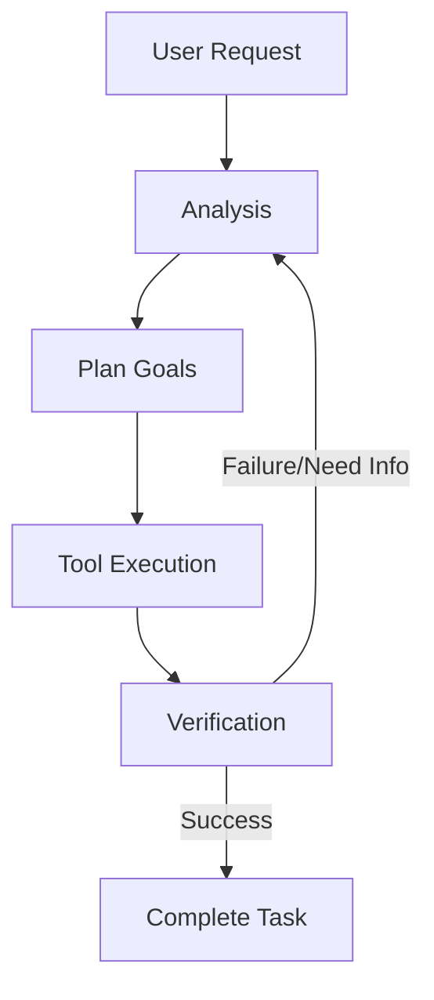

# Roo Code Project Overview

## Overview

Roo Code is an advanced AI coding assistant integrated directly into VS Code. It functions as an autonomous dev team that can understand requirements, plan tasks, write code, and execute commands to verify changes.

## Scope / Non-scope

- **Scope**: Code generation, refactoring, debugging, documentation management, MCP server interaction, terminal command execution, and browser automation.
- **Non-scope**: Direct cloud hosting management, OS-level configuration outside of developer tools.

## Architecture

The project is built as a VS Code extension with a React-based webview.

- **Frontend**: `webview-ui/` (React, Tailwind CSS).
- **Backend**: `src/` (TypeScript).
- **Service Layer**: Handles specialized tasks like `McpHub`, `BrowserSession`, `CodeIndex`, and `CheckpointService`.

## Data Model

- **Task Context**: Maintains history of messages, tool outputs, and environment state.
- **Modes**: Configurations that define available tools and instructions for specific roles (Code, Architect, etc.).

## Flows

1. **User Request**: User sends a prompt via the webview.
2. **Analysis**: Roo Code analyzes the request and environment context.
3. **Tool Execution**: Roo Code calls tools (read file, write file, execute command) to fulfill the request.
4. **Verification**: Roo Code checks outputs and adapts its strategy if needed.

## Edge Cases

- **Large Contexts**: Handled via token management and selective context inclusion.
- **Restricted Files**: Managed through `.rooignore` and mode-specific restrictions.

## Observability (logs / metrics)

- Debug logs are available in the VS Code Output panel.
- Checkpoints allow for reverting changes at any step of a task.

## Testing checklist

- [ ] Unit tests for services (`src/services/**/__tests__`).
- [ ] Integration tests for MCP and Core logic.
- [ ] UI tests for webview components.
